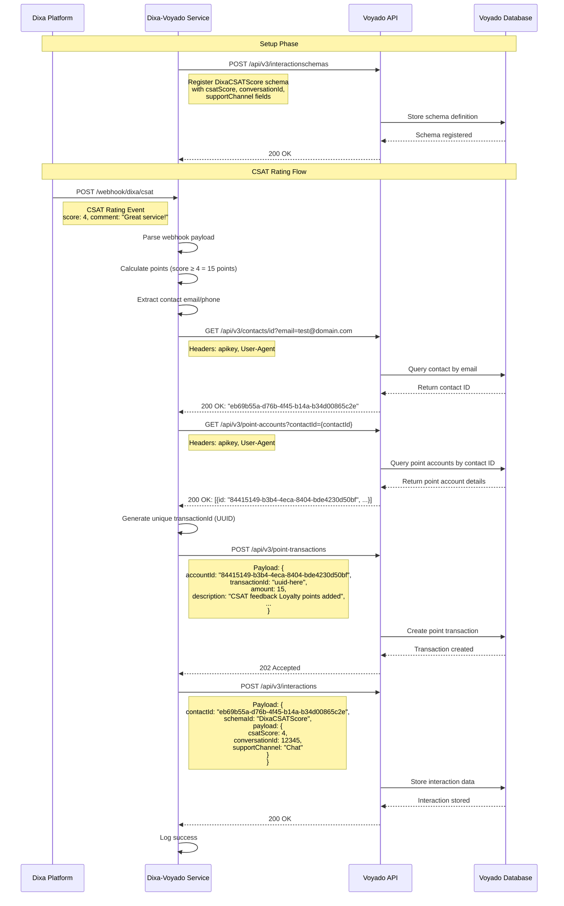
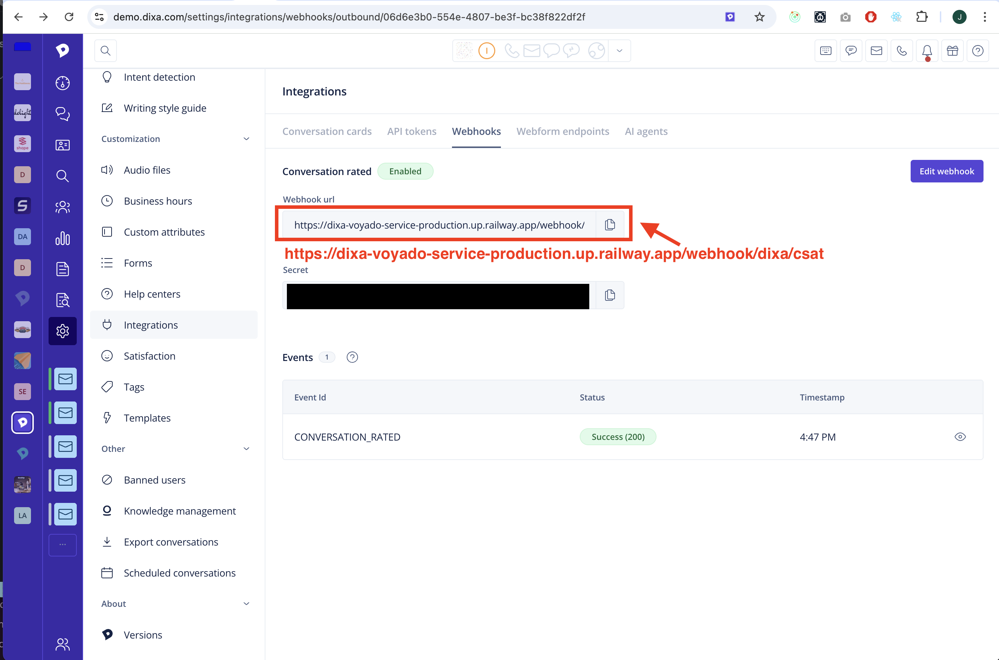

# Dixa-Voyado Webhook Service

A Node.js integration service that handles bidirectional communication between Dixa and Voyado platforms. This service serves as a bridge between two customer experience systems, creating seamless workflows that transform customer feedback into actionable loyalty rewards and review submissions into support conversations.

## Executive Summary

### **Service Overview**

The Dixa-Voyado Webhook Service is a Node.js integration that automatically converts customer satisfaction (CSAT) ratings from Dixa into loyalty points in the Voyado platform. It serves as a bridge between two customer experience systems, creating a seamless feedback-to-rewards workflow.

### **Core Functionality**

#### **Dixa to Voyado Integration (CSAT Processing)**

- **CSAT Processing**: Receives customer satisfaction ratings (1-5 scale) from Dixa via webhooks
- **Smart Point Allocation**: Automatically awards loyalty points based on satisfaction scores:
  - Low scores (≤2): 10 points (compensation)
  - Neutral scores (3): 5 points (default)
  - High scores (≥4): 15 points (reward)
- **Contact Matching**: Uses customer email addresses to identify users across both platforms
- **Point Management**: Integrates with Voyado's point transaction system using unique transaction IDs
- **Interaction Data Storage**: Stores CSAT data in Voyado contact profiles using custom interaction schema for analytics and segmentation

#### **Voyado to Dixa Integration (Review Processing)**

- **Review Webhook Processing**: Receives review submissions from Voyado with contact identifiers
- **Contact Identifier Priority**: Supports contactId, email, or phone number (E.164 format) with priority ordering
- **Voyado Interactions API**: Fetches additional product and comment details from Voyado's Interactions API
- **Dixa End User Management**: Automatically looks up existing end users or creates new ones in Dixa
- **Dixa Conversation Creation**: Creates conversations in Dixa via the Public API using the email channel
- **Configuration Flexibility**: Supports environment variables with webhook payload overrides

### **Technical Architecture**

- **Framework**: Express.js web service
- **Deployment**: Railway cloud platform with automatic HTTPS
- **Integration**: RESTful API connections to both Dixa and Voyado
- **Data Flow**: Asynchronous webhook processing with error handling and logging

### **Key Business Value**

1. **Automated Customer Rewards**: Eliminates manual point allocation based on feedback
2. **Enhanced Customer Experience**: Provides immediate recognition for both positive and negative feedback
3. **Data-Driven Loyalty**: Creates measurable connection between service quality and rewards
4. **Operational Efficiency**: Reduces manual work in customer service and loyalty management

### **Current Status**

- **Production Ready**: Deployed and operational on Railway
- **Live Integration**: Connected to both Dixa and Voyado staging environments
- **Monitoring**: Includes health checks and event logging for operational visibility
- **Testing**: Comprehensive test endpoints for validation and debugging

### **Technical Specifications**

- **Language**: Node.js (v18+)
- **Dependencies**: Express, Axios, UUID, dotenv
- **Endpoints**: 6 API endpoints including webhooks, health checks, and testing
- **Security**: API key authentication, HTTPS enforcement
- **Scalability**: Cloud-native deployment with automatic scaling

This service represents a strategic integration that transforms customer feedback into actionable loyalty rewards, enhancing both customer satisfaction and retention through automated, data-driven point allocation.

## Features

- **Dixa CSAT Webhook Handler**: Receives and processes customer satisfaction ratings
- **Voyado Points Integration**: Automatically awards loyalty points based on CSAT scores
- **Smart Point Calculation**: Different point amounts based on satisfaction scores
- **CSAT Interaction Schema**: Stores detailed CSAT data in Voyado contact profiles for analytics and segmentation

## System Architecture

The following sequence diagram illustrates the complete data flow from Dixa CSAT rating to Voyado points integration:



### Key Data Flow Steps

1. **Schema Registration**: Register the DixaCSATScore interaction schema in Voyado
2. **CSAT Webhook Reception**: Dixa sends rating data to the service
3. **Point Calculation**: Service calculates loyalty points based on CSAT score
4. **Contact Lookup**: Service finds the customer's Voyado contact ID
5. **Point Account Retrieval**: Service gets the customer's point account ID
6. **Points Addition**: Service adds points to Voyado with unique transaction ID
7. **Interaction Storage**: Service stores CSAT data in Voyado contact profile
8. **Success Confirmation**: Service confirms completion to Dixa

## CSAT Interaction Schema

The service now stores detailed CSAT data in Voyado contact profiles using a custom interaction schema. This enables advanced analytics and customer segmentation.

### **Schema Structure**

```json
{
  "interactionSchemaId": "DixaCSATScore",
  "data": {
    "csatScore": 4,
    "conversationId": 12345,
    "supportChannel": "Chat"
  }
}
```

### **Data Fields**

- **csatScore** (1-5): Customer satisfaction rating
- **conversationId**: Dixa conversation identifier (integer)
- **supportChannel**: Communication channel used (Chat, Email, Phone, Social, Other)

### **Business Benefits**

- **Contact Enrichment**: CSAT scores visible in Voyado contact cards
- **Advanced Segmentation**: Create segments like "High CSAT customers" or "Low CSAT customers" using the filtering tool
- **Analytics**: Track CSAT trends by channel, agent, or time period
- **Personalization**: Use CSAT history for targeted campaigns and offers
- **Customer Insights**: Identify patterns in customer satisfaction across different support channels
- **Automated Targeting**: Trigger automated campaigns based on CSAT scores and support channel preferences

### **Segmentation Capabilities**

According to the [Voyado Interaction Segmentation documentation](https://developer.voyado.com/en/interactions/interaction-segmentation.html), our schema enables powerful segmentation features:

- **Filtering Tool Integration**: CSAT scores and support channels appear in Voyado's filtering tool for easy segmentation
- **Multi-Property Segmentation**: Segment customers by CSAT score, support channel, or conversation ID
- **Date Range Filtering**: Filter interactions by specific time periods
- **Automation Triggers**: Use CSAT data to trigger automated email campaigns and promotions
- **Contact Card Display**: CSAT data is visible directly in customer contact cards for agent reference

### **Schema Limitations**

- **Maximum 15 interaction schemas** per Voyado environment
- **Maximum 6 segmentable properties** per schema (our schema uses 2: `csatScore` and `supportChannel`)
- **Supported Types**: Boolean, String, Integer, Number (our schema uses Integer and String)

### **Schema Registration**

**⚠️ Important**: The interaction schema must be registered in Voyado before the service can store CSAT data.

#### **Schema Definition for Voyado**

Submit this schema to your Voyado instance:

```json
{
  "jsonSchema": {
    "$schema": "https://json-schema.org/draft/2020-12/schema",
    "type": "object",
    "properties": {
      "csatScore": {
        "type": "integer",
        "displayName": "CSAT score",
        "showInContactCard": "true",
        "addToSegmentation": "true"
      },
      "conversationId": {
        "type": "integer",
        "displayName": "Conversation ID",
        "showInContactCard": "false",
        "addToSegmentation": "false"
      },
      "supportChannel": {
        "type": "string",
        "displayName": "Support channel",
        "showInContactCard": "true",
        "addToSegmentation": "true"
      }
    }
  },
  "id": "DixaCSATScore",
  "displayName": "Dixa CSAT Score"
}
```

#### **How to Register the Schema**

**Use the Voyado API** (if you have permissions)

```bash
curl -X POST "https://<tenant>.voyado.com/api/v3/interactionschemas" \
  -H "apikey: <your-api-key>" \
  -H "Content-Type: application/json" \
  -d '{
    "jsonSchema": {
      "$schema": "https://json-schema.org/draft/2020-12/schema",
      "type": "object",
      "properties": {
        "csatScore": {
          "type": "integer",
          "displayName": "CSAT score",
          "showInContactCard": "true",
          "addToSegmentation": "true"
        },
        "conversationId": {
          "type": "integer",
          "displayName": "Conversation ID",
          "showInContactCard": "false",
          "addToSegmentation": "false"
        },
        "supportChannel": {
          "type": "string",
          "displayName": "Support channel",
          "showInContactCard": "true",
          "addToSegmentation": "true"
        }
      }
    },
    "id": "DixaCSATScore",
    "displayName": "Dixa CSAT Score"
  }'
```

**Replace the placeholders:**

- `<tenant>`: Your Voyado tenant name
- `<your-api-key>`: Your Voyado API key

#### **Troubleshooting Schema Errors**

If you see this error:

```
❌ Error storing CSAT interaction: Schema 'DixaCSATScore' not found
```

**Fix**: The schema hasn't been registered in Voyado yet. Submit the schema definition above to your Voyado instance.

**Note**: The service will continue to work for point awarding even if interaction storage fails due to missing schema.

## Setup

1. **Install dependencies**:

   ```bash
   npm install
   ```

2. **Configure environment variables**:

   - Copy `.env.example` to `.env`
   - Update `VOYADO_API_KEY` with your actual Voyado API key
   - The Voyado API URL is already configured for staging

3. **Start the service**:

   ```bash
   # Development mode with auto-restart
   npm run dev

   # Production mode
   npm start
   ```

## API Endpoints

### Dixa CSAT Webhook

- **POST** `/webhook/dixa/csat`
- Receives CSAT rating events from Dixa
- Automatically calculates and awards points to Voyado

### Voyado Review Webhook

- **POST** `/webhook/voyado/review`
- Receives review submissions from Voyado
- Automatically looks up or creates end users in Dixa
- Creates conversations in Dixa via the Public API
- Supports contact identification via contactId, email, or phone number (E.164 format)
- Fetches additional details from Voyado's Interactions API
- Configurable via environment variables with webhook payload overrides

### Utility Endpoints

- **GET** `/latest-csat` - View the most recent CSAT event
- **GET** `/health` - Health check endpoint

### Test Endpoints

- **GET** `/test-lookup/:type/:identifier` - Test contact lookup by email or phone
- **POST** `/test-add-points` - Test adding points to a contact
- **POST** `/test-csat-interaction` - Test storing CSAT interaction data
- **POST** `/test-voyado-review` - Test Voyado review webhook processing
- **GET** `/test-dixa-enduser-lookup` - Test Dixa end user lookup
- **POST** `/test-dixa-enduser-create` - Test Dixa end user creation

## Webhook Configuration

### Dixa Webhook Setup

Configure Dixa to send webhooks to:

```
https://the-domain-you-deployed-this-service-on.com/webhook/dixa/csat
```

### Voyado Webhook Setup

Configure Voyado to send review webhooks to:

```
https://the-domain-you-deployed-this-service-on.com/webhook/voyado/review
```

#### Required Environment Variables

Set these environment variables for the Voyado to Dixa integration:

```bash
DIXA_PUBLIC_API_TOKEN=your_dixa_api_token_here
DIXA_EMAIL_INTEGRATION_ID=your_email_integration_id_here  # Optional
```

#### Webhook Payload Override Support

The webhook payload can optionally override environment variables:

```json
{
  "contactId": "cbe3f42c-c1d0-4721-b8ce-ab35001ce051",
  "email": "customer@example.com",
  "phone": "+1234567890",
  "rating": 5,
  "interactionId": "interaction-123",
  "dixaApiToken": "custom_api_token_override",
  "dixaEmailIntegrationId": "custom_email_integration_override"
}
```

#### Contact Identifier Priority

The service uses the following priority order for contact identification:

1. **contactId** (highest priority)
2. **email** (medium priority)
3. **phone** (lowest priority, E.164 format required)

#### End User Management Flow

The service automatically manages Dixa end users as part of the review processing workflow:

1. **End User Lookup**: First attempts to find an existing end user in Dixa using:

   - Email address (if provided)
   - Phone number (if provided)
   - External ID (contactId from Voyado, if provided)

2. **End User Creation**: If no existing end user is found, creates a new one with:

   - Display name (from webhook payload or defaults to email/phone)
   - Email address (if provided)
   - Phone number (if provided)
   - External ID (Voyado contactId, if provided)

3. **Conversation Creation**: Uses the end user ID (existing or newly created) to create the conversation in Dixa

This ensures that all conversations are properly associated with valid end users in Dixa, following the [Dixa End Users API requirements](https://docs.dixa.io/openapi/dixa-api/v1/tag/End-Users/#tag/End-Users/operation/getEndusers).

## Demo

A demo service is running on:

```
https://dixa-voyado-service-production.up.railway.app
```

The demo Dixa webhooks is configured to:

```
https://dixa-voyado-service-production.up.railway.app/webhook/dixa/csat
```



## Example Usage

### Testing Dixa Webhook

```bash
curl -X POST http://localhost:3000/webhook/dixa/csat \
  -H "Content-Type: application/json" \
  -d '{
    "event_id": "e578c093-3cd7-47c5-8b1d-cb6115827b94",
    "event_fqn": "CONVERSATION_RATED",
    "event_version": "1",
    "event_timestamp": "2025-09-03T07:04:08.723Z",
    "data": {
      "score": 4,
      "comment": "Good service today!",
      "conversation": {
        "requester": {
          "name": "John Doe",
          "email": "john@example.com"
        }
      }
    }
  }'
```

### Testing Voyado Review Webhook

#### Example 1: Review with Contact ID

```bash
curl -X POST http://localhost:3000/webhook/voyado/review \
  -H "Content-Type: application/json" \
  -d '{
    "contactId": "cbe3f42c-c1d0-4721-b8ce-ab35001ce051",
    "rating": 5,
    "interactionId": "interaction-123"
  }'
```

#### Example 2: Review with Email Address

```bash
curl -X POST http://localhost:3000/webhook/voyado/review \
  -H "Content-Type: application/json" \
  -d '{
    "email": "customer@example.com",
    "rating": 3,
    "interactionId": "interaction-456"
  }'
```

#### Example 3: Review with Phone Number (E.164 format)

```bash
curl -X POST http://localhost:3000/webhook/voyado/review \
  -H "Content-Type: application/json" \
  -d '{
    "phone": "+1234567890",
    "rating": 5
  }'
```

#### Example 4: Review with API Token Override

```bash
curl -X POST http://localhost:3000/webhook/voyado/review \
  -H "Content-Type: application/json" \
  -d '{
    "contactId": "cbe3f42c-c1d0-4721-b8ce-ab35001ce051",
    "rating": 4,
    "dixaApiToken": "YOUR_CUSTOM_API_TOKEN_HERE",
    "dixaEmailIntegrationId": "custom-email-integration-id"
  }'
```

### Testing CSAT Interaction Storage

```bash
curl -X POST http://localhost:3000/test-csat-interaction \
  -H "Content-Type: application/json" \
  -d '{
    "contactId": "cbe3f42c-c1d0-4721-b8ce-ab35001ce051",
    "csatScore": 4,
    "conversationId": 12345,
    "supportChannel": "Chat"
  }'
```

### Testing Dixa End User Management

#### Example 1: Lookup Existing End User

```bash
curl -X GET "http://localhost:3000/test-dixa-enduser-lookup?email=customer@example.com"
```

#### Example 2: Create New End User

```bash
curl -X POST http://localhost:3000/test-dixa-enduser-create \
  -H "Content-Type: application/json" \
  -d '{
    "email": "newcustomer@example.com",
    "phone": "+1234567890",
    "contactId": "voyado-contact-123",
    "displayName": "New Customer"
  }'
```

### Testing Voyado Review Webhook

You can use the provided test script to test the Voyado review webhook functionality:

```bash
# Run the comprehensive test suite
node test-voyado-review-webhook.js

# Or test with a custom base URL
TEST_BASE_URL=https://your-deployed-service.com node test-voyado-review-webhook.js
```

The test script includes:

- Health check verification
- Multiple test cases with different contact identifier types
- Validation testing for missing required fields
- API token override testing
- Comprehensive error handling verification

## Environment Variables

| Variable                    | Description                          | Default  |
| --------------------------- | ------------------------------------ | -------- |
| `VOYADO_API_KEY`            | Voyado API authentication key        | Required |
| `VOYADO_API_BASE_URL`       | Base URL for Voyado API              | Required |
| `DIXA_PUBLIC_API_TOKEN`     | Dixa Public API authentication token | Required |
| `DIXA_EMAIL_INTEGRATION_ID` | Dixa email integration ID            | Optional |
| `PORT`                      | Server port                          | 3000     |

## Notes

- The service uses the customer's email as the contact identifier for Voyado
- In production, you may need to implement proper contact ID mapping

## Railway Deployment

This service is designed to be deployed on Railway. Railway will automatically:

- Set the `PORT` environment variable
- Provide HTTPS endpoints
- Handle environment variable management
- Scale the service as needed

### Railway Setup

1. **Connect your GitHub repository** to Railway
2. **Set environment variables** in Railway dashboard:
   - `VOYADO_API_KEY`: Your Voyado API key
   - `VOYADO_API_BASE_URL`: `https://yourdomain.voyado.com/api/v3`
   - `DIXA_PUBLIC_API_TOKEN`: Your Dixa Public API token
   - `DIXA_EMAIL_INTEGRATION_ID`: Your Dixa email integration ID (optional)
   - `PORT`: `8080`
3. **Deploy** - Railway will automatically build and deploy your service

### Webhook URLs for Railway

Once deployed, your webhook URLs will be:

- **Dixa CSAT**: `https://your-app-name.railway.app/webhook/dixa/csat`
- **Voyado Review**: `https://your-app-name.railway.app/webhook/voyado/review`

## Security Considerations

- Implement webhook signature verification for production use
- Use HTTPS in production (Railway provides this automatically)
- Consider rate limiting for webhook endpoints
- Validate webhook payloads thoroughly
