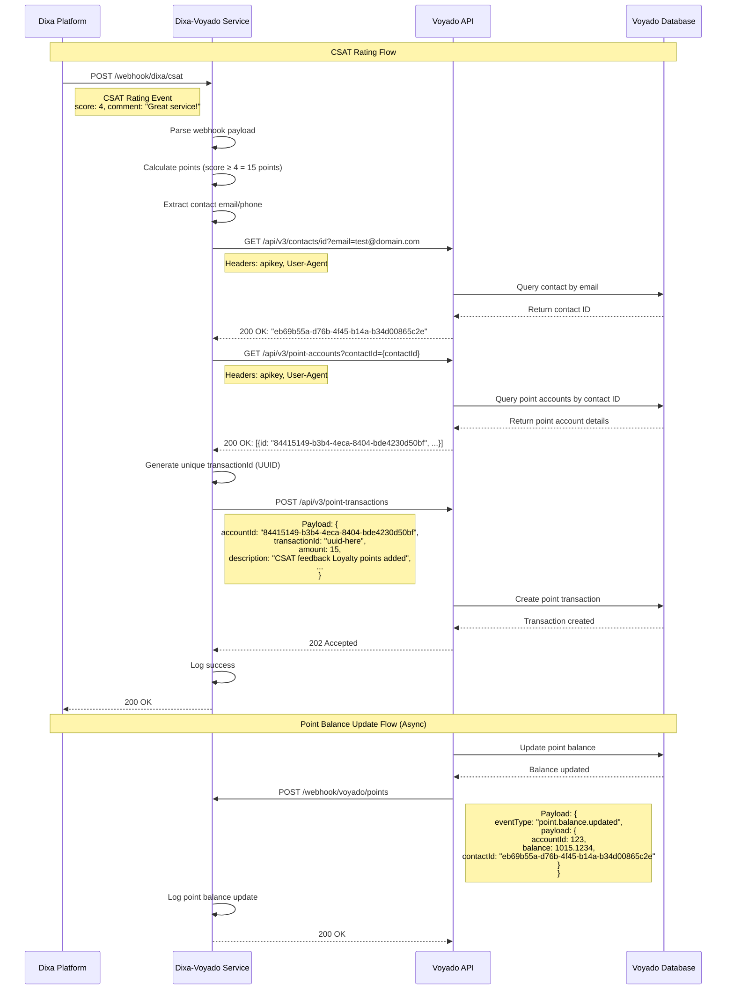

# Dixa-Voyado Webhook Service

A web service built with Express.js that handles CSAT rating webhooks from Dixa and integrates with the Voyado Points API to award loyalty points based on customer satisfaction scores.

## Features

- **Dixa CSAT Webhook Handler**: Receives and processes customer satisfaction ratings
- **Voyado Points Integration**: Automatically awards loyalty points based on CSAT scores
- **Voyado Webhook Handler**: Receives point balance updates from Voyado
- **Smart Point Calculation**: Different point amounts based on satisfaction scores
- **Event Storage**: Stores the latest CSAT event (overwrites previous)

## System Architecture

The following sequence diagram illustrates the complete data flow from Dixa CSAT rating to Voyado points integration:



### Key Data Flow Steps

1. **CSAT Webhook Reception**: Dixa sends rating data to the service
2. **Point Calculation**: Service calculates loyalty points based on CSAT score
3. **Contact Lookup**: Service finds the customer's Voyado contact ID
4. **Point Account Retrieval**: Service gets the customer's point account ID
5. **Points Addition**: Service adds points to Voyado with unique transaction ID
6. **Balance Update Notification**: Voyado sends webhook confirming balance change

## Point Calculation Logic

- **Score ≤ 2**: 10 points (compensation for poor experience)
- **Score = 3**: 5 points (default for neutral experience)
- **Score ≥ 4**: 15 points (reward for good experience)

## Setup

1. **Install dependencies**:

   ```bash
   npm install
   ```

2. **Configure environment variables**:

   - Copy `.env.example` to `.env`
   - Update `VOYADO_API_KEY` with your actual Voyado API key
   - The Voyado API URL is already configured for staging

3. **Start the service**:

   ```bash
   # Development mode with auto-restart
   npm run dev

   # Production mode
   npm start
   ```

## API Endpoints

### Dixa CSAT Webhook

- **POST** `/webhook/dixa/csat`
- Receives CSAT rating events from Dixa
- Automatically calculates and awards points to Voyado

### Voyado Points Webhook

- **POST** `/webhook/voyado/points`
- Receives point balance updates from Voyado
- Logs balance changes for monitoring

### Utility Endpoints

- **GET** `/latest-csat` - View the most recent CSAT event
- **GET** `/health` - Health check endpoint

## Webhook Configuration

### Dixa Webhook Setup

Configure Dixa to send webhooks to:

```
http://your-domain.com/webhook/dixa/csat
```

### Voyado Webhook Setup

Configure Voyado to send webhooks to:

```
http://your-domain.com/webhook/voyado/points
```

## Example Usage

### Testing Dixa Webhook

```bash
curl -X POST http://localhost:3000/webhook/dixa/csat \
  -H "Content-Type: application/json" \
  -d '{
    "event_id": "e578c093-3cd7-47c5-8b1d-cb6115827b94",
    "event_fqn": "CONVERSATION_RATED",
    "event_version": "1",
    "event_timestamp": "2025-09-03T07:04:08.723Z",
    "data": {
      "score": 4,
      "comment": "Good service today!",
      "conversation": {
        "requester": {
          "name": "John Doe",
          "email": "john@example.com"
        }
      }
    }
  }'
```

### Testing Voyado Webhook

```bash
curl -X POST http://localhost:3000/webhook/voyado/points \
  -H "Content-Type: application/json" \
  -d '{
    "eventId": "31e61713-dd4d-4c3f-a470-990ef50b47c0",
    "eventType": "point.balance.updated",
    "payload": {
      "accountId": 123,
      "balance": 1000.1234,
      "contactId": "cbe3f42c-c1d0-4721-b8ce-ab35001ce051"
    }
  }'
```

## Environment Variables

| Variable              | Description                   | Default  |
| --------------------- | ----------------------------- | -------- |
| `VOYADO_API_KEY`      | Voyado API authentication key | Required |
| `VOYADO_API_BASE_URL` | Base URL for Voyado API       | Required |
| `PORT`                | Server port                   | 3000     |

## Notes

- The service uses the customer's email as the contact identifier for Voyado
- In production, you may need to implement proper contact ID mapping
- Each new CSAT event overwrites the previous one in memory
- The service includes comprehensive error handling and logging

## Railway Deployment

This service is designed to be deployed on Railway. Railway will automatically:

- Set the `PORT` environment variable
- Provide HTTPS endpoints
- Handle environment variable management
- Scale the service as needed

### Railway Setup

1. **Connect your GitHub repository** to Railway
2. **Set environment variables** in Railway dashboard:
   - `VOYADO_API_KEY`: Your Voyado API key
   - `VOYADO_API_BASE_URL`: `https://dixa.staging.voyado.com/api/v3`
3. **Deploy** - Railway will automatically build and deploy your service

### Webhook URLs for Railway

Once deployed, your webhook URLs will be:

- **Dixa CSAT**: `https://your-app-name.railway.app/webhook/dixa/csat`
- **Voyado Points**: `https://your-app-name.railway.app/webhook/voyado/points`

## Security Considerations

- Implement webhook signature verification for production use
- Use HTTPS in production (Railway provides this automatically)
- Consider rate limiting for webhook endpoints
- Validate webhook payloads thoroughly
