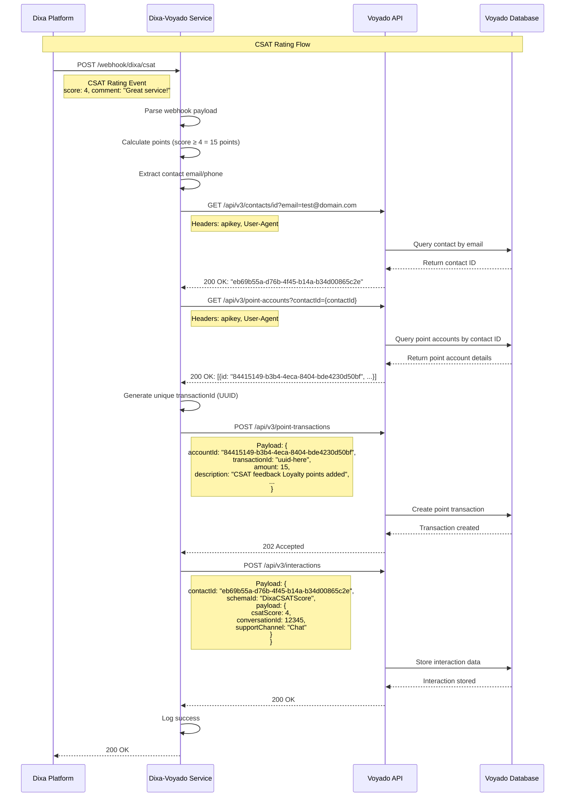

# Dixa-Voyado Webhook Service

A Node.js integration service that automatically converts customer satisfaction (CSAT) ratings from Dixa into loyalty points in the Voyado platform. This service serves as a bridge between two customer experience systems, creating a seamless feedback-to-rewards workflow that transforms customer feedback into actionable loyalty rewards.

## Executive Summary

### **Service Overview**

The Dixa-Voyado Webhook Service is a Node.js integration that automatically converts customer satisfaction (CSAT) ratings from Dixa into loyalty points in the Voyado platform. It serves as a bridge between two customer experience systems, creating a seamless feedback-to-rewards workflow.

### **Core Functionality**

- **CSAT Processing**: Receives customer satisfaction ratings (1-5 scale) from Dixa via webhooks
- **Smart Point Allocation**: Automatically awards loyalty points based on satisfaction scores:
  - Low scores (≤2): 10 points (compensation)
  - Neutral scores (3): 5 points (default)
  - High scores (≥4): 15 points (reward)
- **Contact Matching**: Uses customer email addresses to identify users across both platforms
- **Point Management**: Integrates with Voyado's point transaction system using unique transaction IDs
- **Interaction Data Storage**: Stores CSAT data in Voyado contact profiles using custom interaction schema for analytics and segmentation

### **Technical Architecture**

- **Framework**: Express.js web service
- **Deployment**: Railway cloud platform with automatic HTTPS
- **Integration**: RESTful API connections to both Dixa and Voyado
- **Data Flow**: Asynchronous webhook processing with error handling and logging

### **Key Business Value**

1. **Automated Customer Rewards**: Eliminates manual point allocation based on feedback
2. **Enhanced Customer Experience**: Provides immediate recognition for both positive and negative feedback
3. **Data-Driven Loyalty**: Creates measurable connection between service quality and rewards
4. **Operational Efficiency**: Reduces manual work in customer service and loyalty management

### **Current Status**

- **Production Ready**: Deployed and operational on Railway
- **Live Integration**: Connected to both Dixa and Voyado staging environments
- **Monitoring**: Includes health checks and event logging for operational visibility
- **Testing**: Comprehensive test endpoints for validation and debugging

### **Technical Specifications**

- **Language**: Node.js (v18+)
- **Dependencies**: Express, Axios, UUID, dotenv
- **Endpoints**: 6 API endpoints including webhooks, health checks, and testing
- **Security**: API key authentication, HTTPS enforcement
- **Scalability**: Cloud-native deployment with automatic scaling

This service represents a strategic integration that transforms customer feedback into actionable loyalty rewards, enhancing both customer satisfaction and retention through automated, data-driven point allocation.

## Features

- **Dixa CSAT Webhook Handler**: Receives and processes customer satisfaction ratings
- **Voyado Points Integration**: Automatically awards loyalty points based on CSAT scores
- **Smart Point Calculation**: Different point amounts based on satisfaction scores
- **CSAT Interaction Schema**: Stores detailed CSAT data in Voyado contact profiles for analytics and segmentation

## System Architecture

The following sequence diagram illustrates the complete data flow from Dixa CSAT rating to Voyado points integration:



### Key Data Flow Steps

1. **CSAT Webhook Reception**: Dixa sends rating data to the service
2. **Point Calculation**: Service calculates loyalty points based on CSAT score
3. **Contact Lookup**: Service finds the customer's Voyado contact ID
4. **Point Account Retrieval**: Service gets the customer's point account ID
5. **Points Addition**: Service adds points to Voyado with unique transaction ID
6. **Interaction Storage**: Service stores CSAT data in Voyado contact profile
7. **Success Confirmation**: Service confirms completion to Dixa

## CSAT Interaction Schema

The service now stores detailed CSAT data in Voyado contact profiles using a custom interaction schema. This enables advanced analytics and customer segmentation.

### **Schema Structure**

```json
{
  "interactionSchemaId": "DixaCSATScore",
  "data": {
    "csatScore": 4,
    "conversationId": 12345,
    "supportChannel": "Chat"
  }
}
```

### **Data Fields**

- **csatScore** (1-5): Customer satisfaction rating
- **conversationId**: Dixa conversation identifier (integer)
- **supportChannel**: Communication channel used (Chat, Email, Phone, Social, Other)

### **Business Benefits**

- **Contact Enrichment**: CSAT scores visible in Voyado contact cards
- **Segmentation**: Create segments like "High CSAT customers" or "Low CSAT customers"
- **Analytics**: Track CSAT trends by channel, agent, or time period
- **Personalization**: Use CSAT history for targeted campaigns and offers

### **Schema Registration**

**⚠️ Important**: The interaction schema must be registered in Voyado before the service can store CSAT data.

#### **Schema Definition for Voyado**

Submit this schema to your Voyado instance:

```json
{
  "jsonSchema": {
    "$schema": "https://json-schema.org/draft/2020-12/schema",
    "type": "object",
    "properties": {
      "csatScore": {
        "type": "integer",
        "displayName": "CSAT score",
        "showInContactCard": "true",
        "addToSegmentation": "true"
      },
      "conversationId": {
        "type": "integer",
        "displayName": "Conversation ID",
        "showInContactCard": "false",
        "addToSegmentation": "false"
      },
      "supportChannel": {
        "type": "string",
        "displayName": "Support channel",
        "showInContactCard": "true",
        "addToSegmentation": "true"
      }
    }
  },
  "id": "DixaCSATScore",
  "displayName": "Dixa CSAT Score"
}
```

#### **How to Register the Schema**

**Use the Voyado API** (if you have permissions)

```bash
curl -X POST "https://<tenant>.voyado.com/api/v3/interactionschemas" \
  -H "apikey: <your-api-key>" \
  -H "Content-Type: application/json" \
  -d '{
    "jsonSchema": {
      "$schema": "https://json-schema.org/draft/2020-12/schema",
      "type": "object",
      "properties": {
        "csatScore": {
          "type": "integer",
          "displayName": "CSAT score",
          "showInContactCard": "true",
          "addToSegmentation": "true"
        },
        "conversationId": {
          "type": "integer",
          "displayName": "Conversation ID",
          "showInContactCard": "false",
          "addToSegmentation": "false"
        },
        "supportChannel": {
          "type": "string",
          "displayName": "Support channel",
          "showInContactCard": "true",
          "addToSegmentation": "true"
        }
      }
    },
    "id": "DixaCSATScore",
    "displayName": "Dixa CSAT Score"
  }'
```

**Replace the placeholders:**

- `<tenant>`: Your Voyado tenant name
- `<your-api-key>`: Your Voyado API key

#### **Troubleshooting Schema Errors**

If you see this error:

```
❌ Error storing CSAT interaction: Schema 'DixaCSATScore' not found
```

**Fix**: The schema hasn't been registered in Voyado yet. Submit the schema definition above to your Voyado instance.

**Note**: The service will continue to work for point awarding even if interaction storage fails due to missing schema.

## Setup

1. **Install dependencies**:

   ```bash
   npm install
   ```

2. **Configure environment variables**:

   - Copy `.env.example` to `.env`
   - Update `VOYADO_API_KEY` with your actual Voyado API key
   - The Voyado API URL is already configured for staging

3. **Start the service**:

   ```bash
   # Development mode with auto-restart
   npm run dev

   # Production mode
   npm start
   ```

## API Endpoints

### Dixa CSAT Webhook

- **POST** `/webhook/dixa/csat`
- Receives CSAT rating events from Dixa
- Automatically calculates and awards points to Voyado

### Utility Endpoints

- **GET** `/latest-csat` - View the most recent CSAT event
- **GET** `/health` - Health check endpoint

### Test Endpoints

- **GET** `/test-lookup/:type/:identifier` - Test contact lookup by email or phone
- **POST** `/test-add-points` - Test adding points to a contact
- **POST** `/test-csat-interaction` - Test storing CSAT interaction data

## Webhook Configuration

### Dixa Webhook Setup

Configure Dixa to send webhooks to:

```
https://the-domain-you-deployed-this-service-on.com/webhook/dixa/csat
```

## Demo

A demo service is running on:

```
https://dixa-voyado-service-production.up.railway.app
```

The demo Dixa webhooks is configured to:

```
https://dixa-voyado-service-production.up.railway.app/webhook/dixa/csat
```


## Example Usage

### Testing Dixa Webhook

```bash
curl -X POST http://localhost:3000/webhook/dixa/csat \
  -H "Content-Type: application/json" \
  -d '{
    "event_id": "e578c093-3cd7-47c5-8b1d-cb6115827b94",
    "event_fqn": "CONVERSATION_RATED",
    "event_version": "1",
    "event_timestamp": "2025-09-03T07:04:08.723Z",
    "data": {
      "score": 4,
      "comment": "Good service today!",
      "conversation": {
        "requester": {
          "name": "John Doe",
          "email": "john@example.com"
        }
      }
    }
  }'
```

### Testing CSAT Interaction Storage

```bash
curl -X POST http://localhost:3000/test-csat-interaction \
  -H "Content-Type: application/json" \
  -d '{
    "contactId": "cbe3f42c-c1d0-4721-b8ce-ab35001ce051",
    "csatScore": 4,
    "conversationId": 12345,
    "supportChannel": "Chat"
  }'
```

## Environment Variables

| Variable              | Description                   | Default  |
| --------------------- | ----------------------------- | -------- |
| `VOYADO_API_KEY`      | Voyado API authentication key | Required |
| `VOYADO_API_BASE_URL` | Base URL for Voyado API       | Required |
| `PORT`                | Server port                   | 3000     |

## Notes

- The service uses the customer's email as the contact identifier for Voyado
- In production, you may need to implement proper contact ID mapping

## Railway Deployment

This service is designed to be deployed on Railway. Railway will automatically:

- Set the `PORT` environment variable
- Provide HTTPS endpoints
- Handle environment variable management
- Scale the service as needed

### Railway Setup

1. **Connect your GitHub repository** to Railway
2. **Set environment variables** in Railway dashboard:
   - `VOYADO_API_KEY`: Your Voyado API key
   - `VOYADO_API_BASE_URL`: `https://yourdomain.voyado.com/api/v3`
   - `PORT`: `8080`
3. **Deploy** - Railway will automatically build and deploy your service

### Webhook URLs for Railway

Once deployed, your webhook URL will be:

- **Dixa CSAT**: `https://your-app-name.railway.app/webhook/dixa/csat`

## Security Considerations

- Implement webhook signature verification for production use
- Use HTTPS in production (Railway provides this automatically)
- Consider rate limiting for webhook endpoints
- Validate webhook payloads thoroughly
